status:portfolio 
# Statistical Analysis — Airline Delay Dataset

## Overview

This R script performs a comprehensive statistical analysis of airline delay data, covering descriptive statistics, hypothesis testing, clustering, regression, and classification. It is designed to be fully reproducible (`set.seed(42)`) and self-installing (auto-installs missing packages).

## Dataset

**File:** `airline_stats.csv`

| Column               | Type   | Description                              |
|----------------------|--------|------------------------------------------|
| `pct_carrier_delay`  | numeric | Percentage of delays caused by the carrier |
| `pct_atc_delay`      | numeric | Percentage of delays caused by air traffic control |
| `pct_weather_delay`  | numeric | Percentage of delays caused by weather   |
| `airline`            | factor | Airline name                             |

Rows with missing values are removed via `na.omit()` before analysis. The random seed is set globally to `42` for reproducibility.

## Dependencies

The script auto-installs any missing packages from CRAN:

| Package       | Purpose                                  |
|---------------|------------------------------------------|
| `ggplot2`     | Visualization                            |
| `cluster`     | Clustering algorithms                    |
| `dplyr`       | Data manipulation                        |
| `tidyr`       | Data reshaping                           |
| `factoextra`  | Cluster visualization                    |
| `dunn.test`   | Dunn's post-hoc test                     |
| `car`         | Levene's test, VIF                       |
| `broom`       | Tidy model summaries                     |
| `pheatmap`    | Heatmaps                                 |

---

## Analysis Sections

### 1. Descriptive Statistics & Distribution Plots

Generates a grouped boxplot of all three delay types across airlines and saves it as `delay_distributions.png`.

**Output:** `delay_distributions.png`

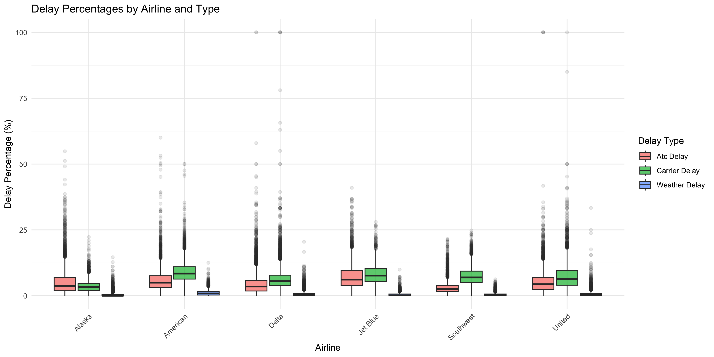

---

### 2. One-Way ANOVA

Tests whether mean delay percentages differ significantly across airlines for each delay type:

- **Carrier delay** ~ airline
- **ATC delay** ~ airline
- **Weather delay** ~ airline

#### Assumption Checks

| Assumption          | Test                     |
|---------------------|--------------------------|
| Normality of residuals | Shapiro-Wilk test     |
| Homogeneity of variances | Levene's test (falls back to Bartlett's) |

#### Post-Hoc

- **Tukey HSD** for pairwise comparisons (carrier delay model)

**Output:** `anova_carrier_delay.png`

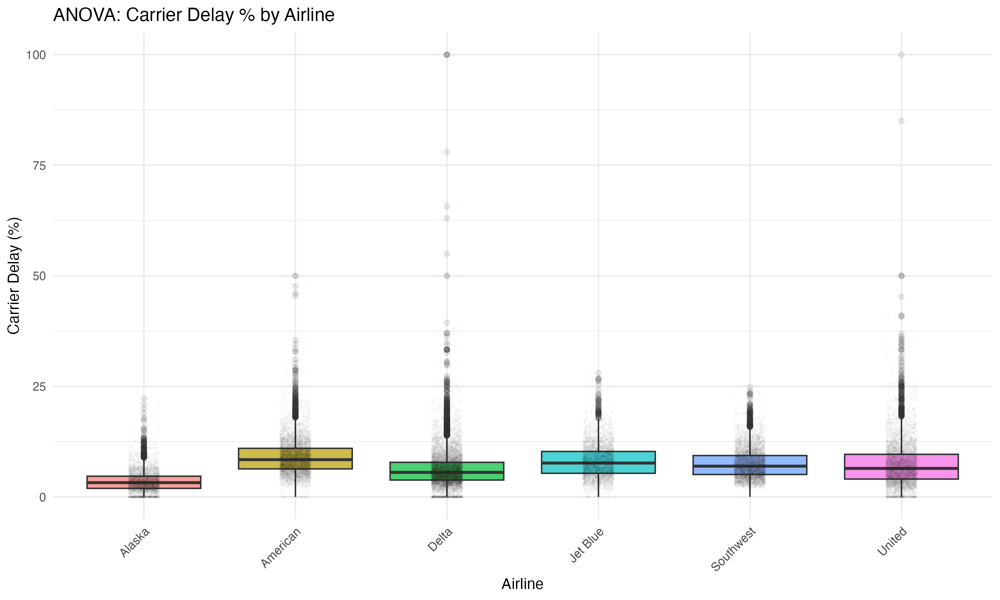

---

### 3. Independent Samples t-Test

Compares carrier delay between **Delta** and **United**:

- **F-test** for equality of variances
- **Welch's t-test** (unequal variances assumed)
- **Pooled variance t-test** (equal variances assumed)
- **Cohen's d** effect size with interpretation
- **Pairwise t-tests** across all airline pairs with **Bonferroni correction**

Effect size interpretation thresholds for Cohen's d:

| Range      | Interpretation |
|------------|----------------|
| < 0.2      | Negligible     |
| 0.2 – 0.5  | Small          |
| 0.5 – 0.8  | Medium         |
| ≥ 0.8      | Large          |

---

### 4. Wilcoxon Rank-Sum Test (Non-Parametric)

Non-parametric alternative to the t-test:

- **Mann-Whitney U / Wilcoxon rank-sum** test (Delta vs United)
- Effect size **r = Z / √N** with interpretation
- **Kruskal-Wallis test** (non-parametric ANOVA alternative) for carrier and ATC delays
- **Dunn's post-hoc test** with Bonferroni correction

Effect size interpretation thresholds for r:

| Range      | Interpretation |
|------------|----------------|
| < 0.1      | Negligible     |
| 0.1 – 0.3  | Small          |
| 0.3 – 0.5  | Medium         |
| ≥ 0.5      | Large          |

**Output:** `wilcoxon_comparison.png`

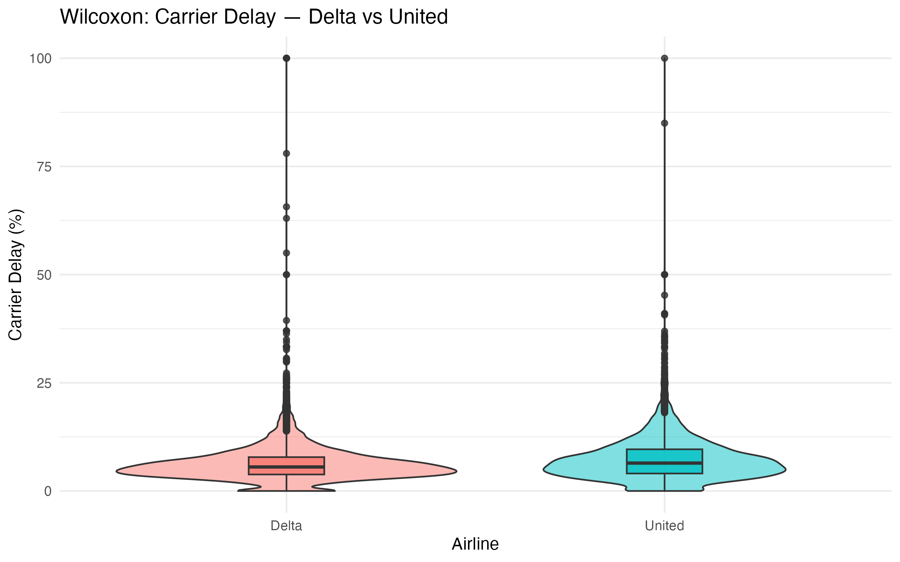

---

### 5. Clustering Analysis

#### 5a. Hierarchical Clustering — Individual Flights

- Euclidean distance, Ward.D2 linkage
- Dendrogram cut into **k = 6** clusters

**Output:** `dendrogram.png`

> Note: `dendrogram.png` was not present in the output directory at time of writing.

#### 5b. Hierarchical Clustering — Airline Profiles

- Airlines clustered by their mean delay profiles (carrier, ATC, weather)
- Euclidean distance, Ward.D2 linkage

**Output:** `airline_dendrogram.png`

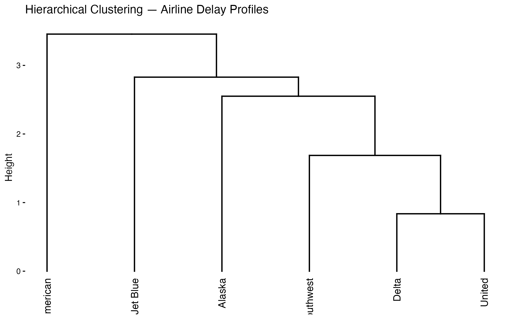

#### 5c. K-Means — Airline Profiles

- Optimal k selected via **elbow method** and **silhouette method**
- k-means run with `nstart = 25` for stability
- Reports cluster assignments, standardized centers, and between-SS / total-SS ratio

**Outputs:** `elbow_plot.png`, `silhouette_plot.png`, `kmeans_airlines.png`

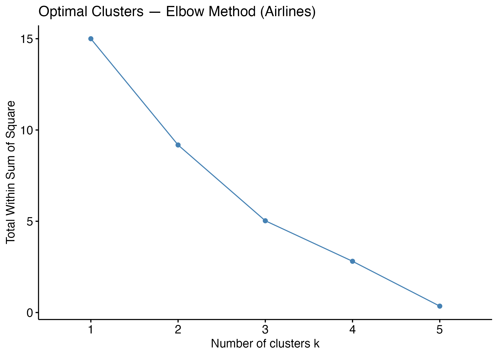

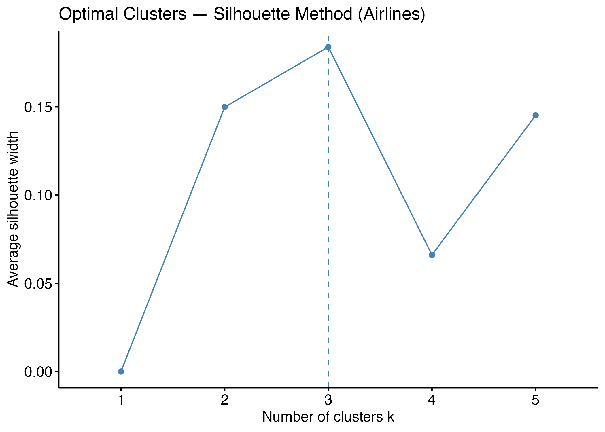

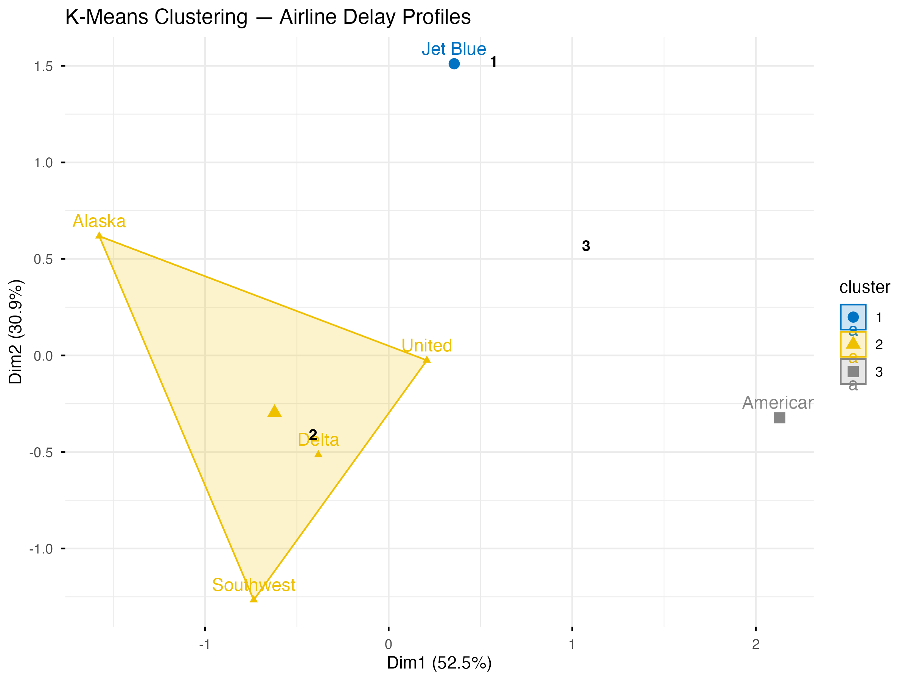

#### 5d. K-Means — Flight-Level (Sampled)

- Random sample of **5,000 flights** for computational efficiency
- k = 6 clusters, `nstart = 25`
- Cluster profiles summarized with top airline, average delays, and cluster sizes

**Output:** `kmeans_flights.png`

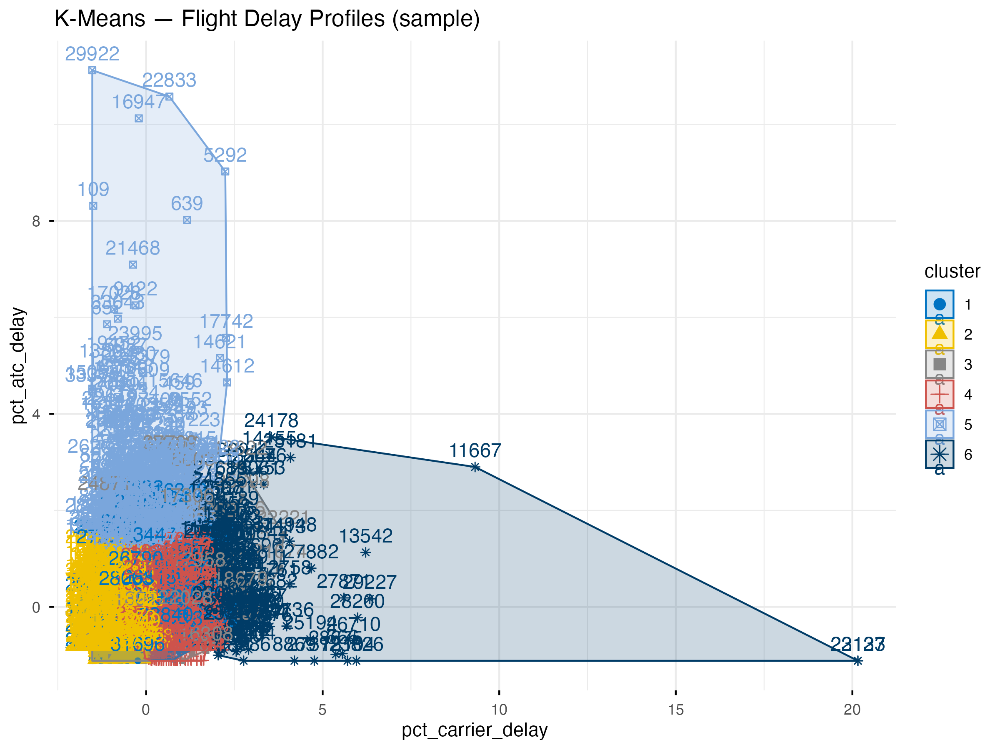

#### 5e. Heatmap

- Tile heatmap of average delay percentages by airline and delay type

**Output:** `airline_heatmap.png`

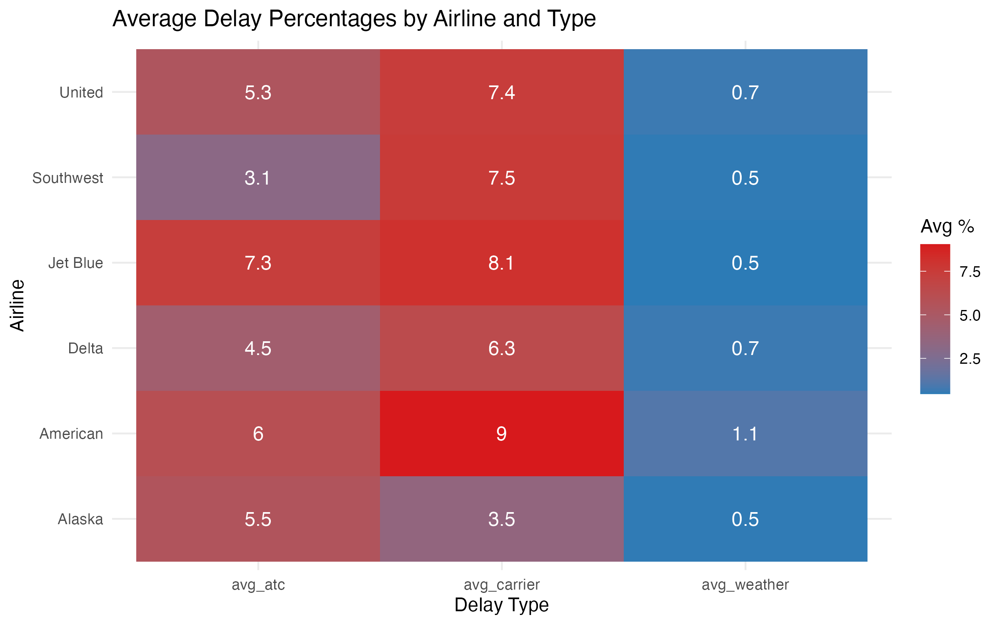

---

### 6. Linear Regression

Four models are fitted and compared:

| Model        | Formula                                              |
|--------------|------------------------------------------------------|
| Simple       | `carrier_delay ~ atc_delay`                          |
| Multiple     | `carrier_delay ~ atc_delay + weather_delay`          |
| Airline      | `carrier_delay ~ atc_delay + weather_delay + airline` |
| Interaction  | `carrier_delay ~ atc_delay * airline`                |

#### Diagnostics

- **AIC-based model comparison** (lowest AIC = best)
- **4-panel diagnostic plots** (residuals vs fitted, Q-Q, scale-location, leverage)
- **Variance Inflation Factors (VIF)** for multicollinearity check
  - VIF > 5 flagged as moderate-to-high multicollinearity
- Scatterplot with per-airline regression lines and a global trend line

**Outputs:** `regression_diagnostics.png`, `regression_plot.png`

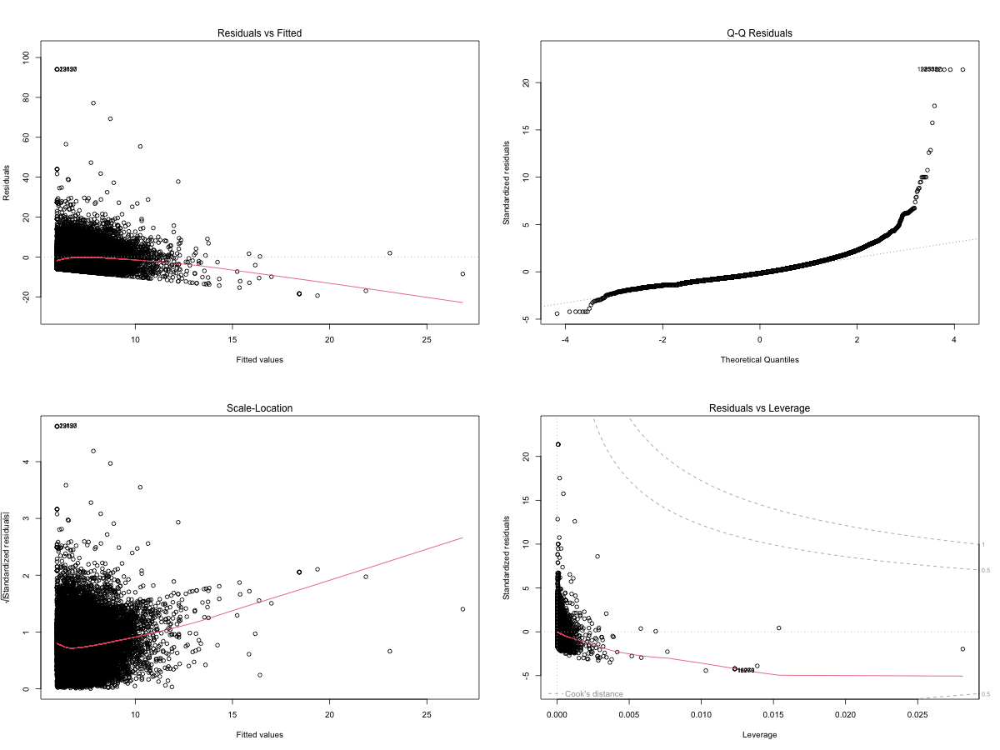

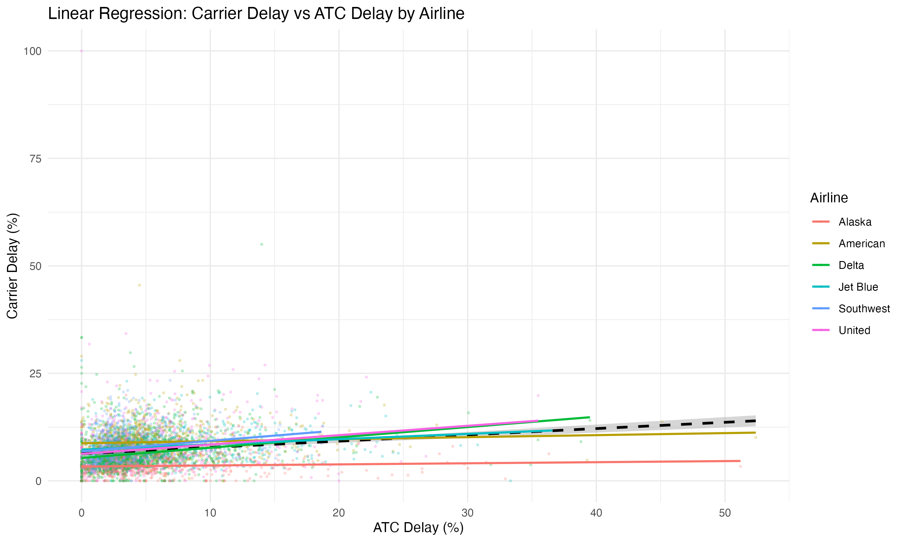

---

### 7. Logistic Regression

Predicts binary airline membership (most frequent airline vs. all others) from delay profile:

```
P(target_airline) ~ carrier_delay + atc_delay + weather_delay
```

#### Outputs

| Output                  | Description                              |
|-------------------------|------------------------------------------|
| Coefficients & p-values | Full `glm` summary                       |
| Odds ratios             | `exp(coef)` with 95% confidence intervals |
| Model fit               | Null/residual deviance, AIC              |
| Hosmer-Lemeshow test    | Goodness-of-fit (p > 0.05 = good fit)    |
| Classification table    | Confusion matrix at threshold = 0.5      |
| Performance metrics     | Accuracy, sensitivity, specificity, PPV, NPV |
| ROC curve               | AUC computed via trapezoidal integration |

**Complete separation check:** Warns if any coefficient exceeds ±10, suggesting the need for Firth's penalized likelihood (`logistf` package).

**Outputs:** `logistic_regression_plot.png`, `roc_curve.png`

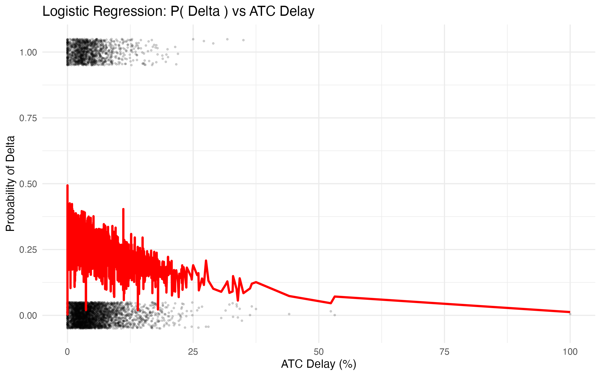

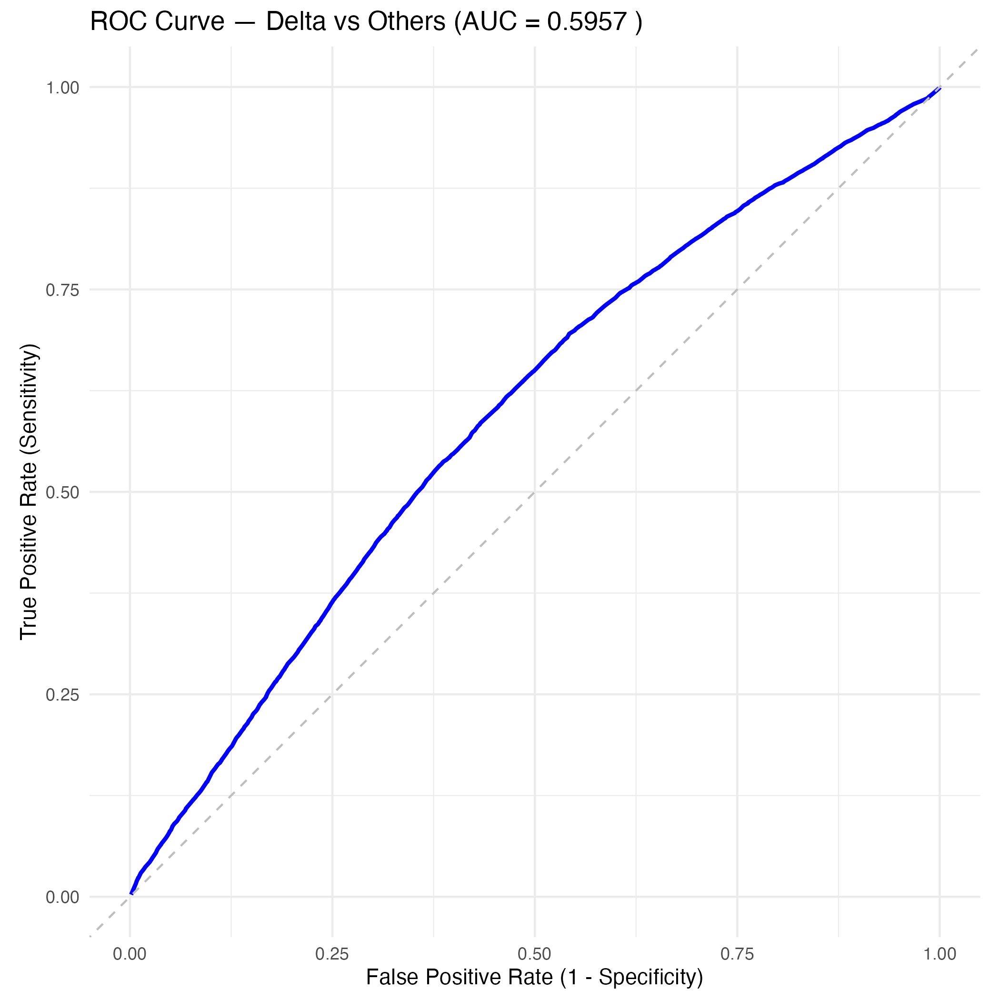

---

## Generated Output Files

| #   | File                            | Description                              | Preview |
|-----|---------------------------------|------------------------------------------|---------|
| 1   | `delay_distributions.png`      | Delay type boxplots by airline           |  |
| 2   | `anova_carrier_delay.png`      | ANOVA boxplot with jittered points       |  |
| 3   | `wilcoxon_comparison.png`      | Violin + boxplot (Delta vs United)       |  |
| 4   | `dendrogram.png`               | Hierarchical clustering (all flights)    | *(not available)* |
| 5   | `airline_dendrogram.png`       | Hierarchical clustering (airline means)  |  |
| 6   | `elbow_plot.png`               | Elbow method for optimal k               |  |
| 7   | `silhouette_plot.png`          | Silhouette method for optimal k          |  |
| 8   | `kmeans_airlines.png`          | K-means clusters (airline profiles)      |  |
| 9   | `kmeans_flights.png`           | K-means clusters (flight-level sample)   |  |
| 10  | `airline_heatmap.png`          | Average delay heatmap                    |  |
| 11  | `regression_diagnostics.png`   | 4-panel LM diagnostic plots              |  |
| 12  | `regression_plot.png`          | Regression scatterplot by airline        |  |
| 13  | `logistic_regression_plot.png` | Logistic probability curve               |  |
| 14  | `roc_curve.png`                | ROC curve with AUC                      |  |

---

## How to Run

```r
source("statistical_analysis.R")
```

Or from the command line:

```bash
Rscript statistical_analysis.R
```

Make sure `airline_stats.csv` is in the same directory (or update the file path on line 30).

---

## Notes

- **Reproducibility:** `set.seed(42)` is called at the top and before each stochastic operation.
- **Independence assumption:** ANOVA assumes independent observations. Flight delays may violate this if clustered by date, route, or carrier policy — interpret results accordingly.
- **Complete separation:** The logistic regression checks for this and warns if detected.
- **Computational efficiency:** Flight-level k-means uses a 5,000-row sample to keep runtime reasonable.
